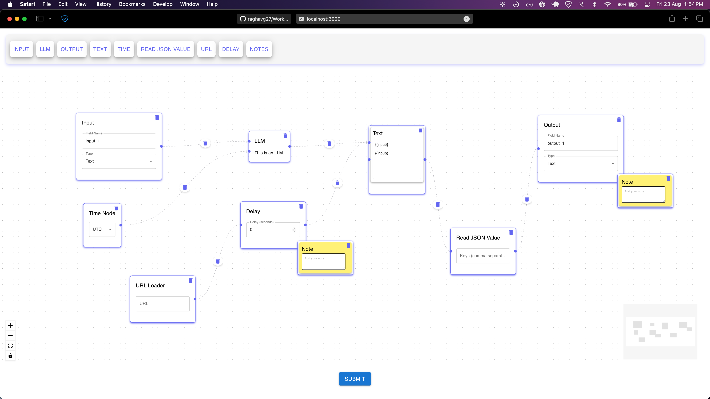

# 🚀 WorkflowAI
AI-driven automation with an intuitive no-code interface.



Welcome to the WorkflowAI Application! This project demonstrates a powerful and flexible tool for creating complex workflows using a variety of custom nodes and edges. It showcases advanced frontend development skills, leveraging React, React Flow, Material-UI, and Zustand for state management. 

## 🌟 Features

### 1. **Custom Node Abstraction**
   - **BaseNode Component:** Developed a `BaseNode` component that encapsulates shared logic across multiple nodes, ensuring code reusability and consistency.
   - **Custom Nodes:** Implemented five custom nodes:
     - **URL Loader Node:** Fetches JSON data from a URL and feeds it into the pipeline.
     - **Note Node:** A sticky note-style node for adding annotations within the pipeline.
     - **Delay Node:** Adds a delay in the pipeline flow, allowing for time-based operations.
     - **Time Node:** Outputs the current time in different timezones, perfect for time-sensitive workflows.
     - **Read JSON Value Node:** Extracts specific values from JSON strings using input keys.

### 2. **Custom Edges with Interactive Features**
   - **Custom Edge Implementation:** Introduced custom edges with smooth transitions and arrows, enhancing visual clarity.
   - **Edge Delete Button:** Added a delete button directly on the edge, allowing for easy removal and improving user interaction.

### 3. **Dynamic and Responsive UI**
   - **Pipeline Toolbar:** A fully styled and responsive toolbar for dragging and dropping nodes into the pipeline, using Material-UI for a modern look and feel.
   - **Node Styling:** All nodes feature cohesive and attractive designs, ensuring a polished user experience across different devices and screen sizes.
   - **Text Node Logic:** The Text Node dynamically adjusts its size based on input length, with support for JavaScript variables, adding flexibility and power to pipeline creation.

### 4. **Seamless Integration with Backend**
   - **Backend Communication:** The application integrates with a Python-based backend to analyze the pipeline's structure.
   - **DAG Validation:** On submission, the application checks if the pipeline forms a Directed Acyclic Graph (DAG), providing instant feedback to the user.

### 5. **Advanced State Management**
   - **Zustand for State Management:** Leveraged Zustand to efficiently manage the application's state, ensuring a smooth and responsive experience.

## 🎯 How to Use

1. **Clone the Repository:**
   ```bash
   git clone https://github.com/raghavg27/WorkflowAI.git
   cd WorkflowAI
   ```

2. **Install Dependencies:**
   ```bash
   npm install
   ```

3. **Start the Application:**
   ```bash
   npm start
   ```

4. **Build Your Pipeline:**
   - Drag and drop nodes from the toolbar into the main canvas.
   - Connect nodes using edges to define the workflow.
   - Use the delete buttons on nodes and edges for easy modifications.
   - Submit your pipeline to check if it forms a DAG.

## 🛠 Technologies Used

- **React** - A JavaScript library for building user interfaces.
- **React Flow** - For visualizing and building node-based workflows.
- **Material-UI** - For designing a modern, responsive UI.
- **Zustand** - Lightweight and flexible state management for React.
- **Python (Backend)** - Handles DAG validation and other backend operations.

## 📸 Screenshots

_Add screenshots of the application here to visually demonstrate its features._

## 🤝 Contributions

Contributions, issues, and feature requests are welcome! Feel free to check out the [issues page](https://github.com/raghavg27/WorkflowAI/issues).

## 📄 License

This project is licensed under the MIT License - see the [LICENSE](LICENSE) file for details.

